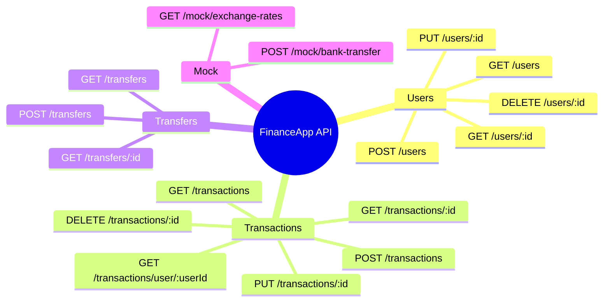

# API Endpoints

Base URL: `http://localhost:5117`

## Endpoint Map

## Reference Table

### Users

| Method | Path | Description |
|--------|------|-------------|
| `POST` | `/users` | Create a new user |
| `GET` | `/users` | List all users |
| `GET` | `/users/{id}` | Get a single user |
| `PUT` | `/users/{id}` | Update a user |
| `DELETE` | `/users/{id}` | Delete a user |

### Transactions

| Method | Path | Description |
|--------|------|-------------|
| `POST` | `/transactions` | Create a transaction |
| `GET` | `/transactions` | List all transactions |
| `GET` | `/transactions/{id}` | Get a single transaction |
| `GET` | `/transactions/user/{userId}` | Filter transactions by user |
| `PUT` | `/transactions/{id}` | Update a transaction |
| `DELETE` | `/transactions/{id}` | Delete a transaction |

### Transfers

| Method | Path | Description |
|--------|------|-------------|
| `POST` | `/transfers` | Create a transfer |
| `GET` | `/transfers` | List all transfers |
| `GET` | `/transfers/{id}` | Get a single transfer |

### Mock Services

| Method | Path | Description |
|--------|------|-------------|
| `GET` | `/mock/exchange-rates` | Returns fixed EUR, USD, TRY rates |
| `POST` | `/mock/bank-transfer` | Simulates an external bank transfer |
