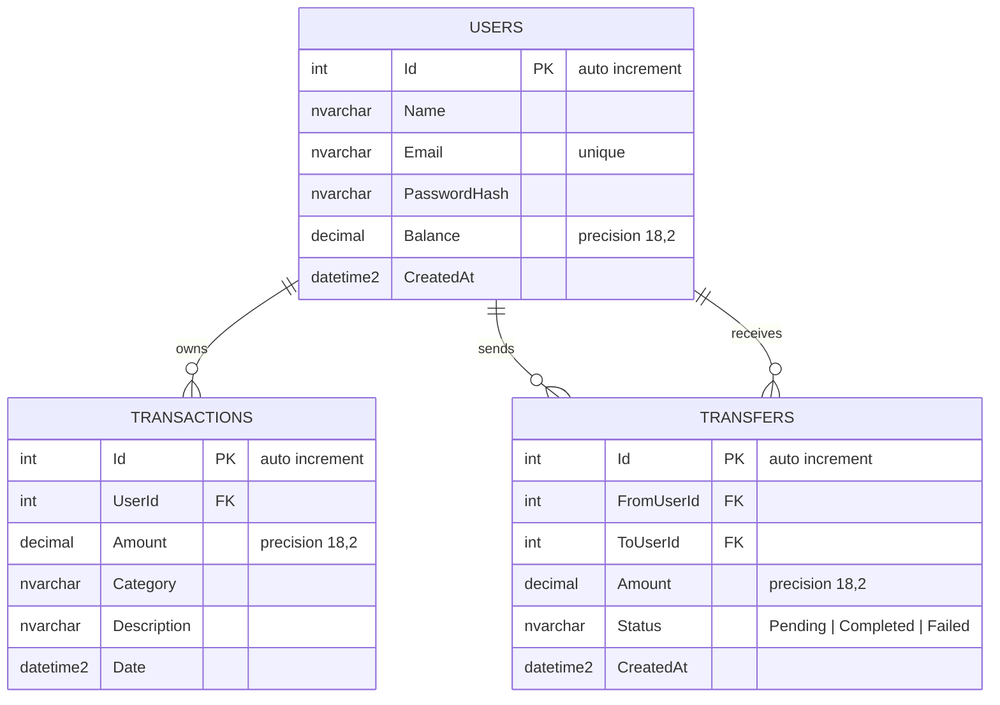

# Database Schema

Database: `FinanceApp` on SQL Server Express

## ER Diagram

## Notes

- `USERS.Email` has a unique index enforced at the database level.
- `TRANSACTIONS.UserId` uses `ON DELETE CASCADE` — deleting a user removes their transactions.
- `TRANSFERS.FromUserId` and `TRANSFERS.ToUserId` use `ON DELETE NO ACTION` to prevent cascade conflicts when both FKs point to the same table.
- All `decimal` columns are `decimal(18, 2)` — suitable for currency values.
