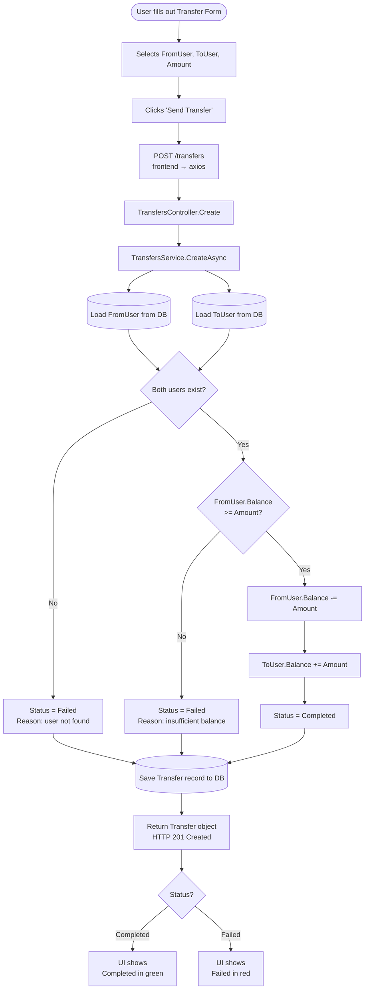
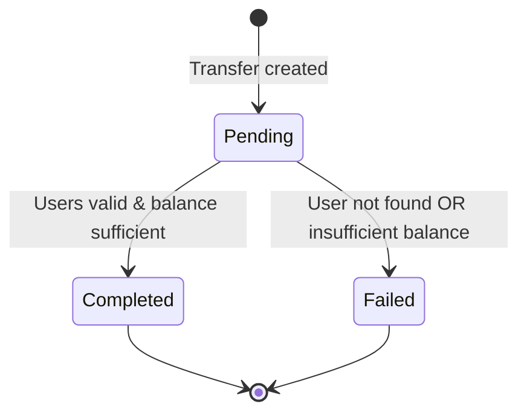

# Transfer Flow

End-to-end flow of a transfer request from the frontend to the database.

## Flowchart

## State Transitions

## Summary

| Condition | Outcome |
|-----------|---------|
| `FromUser` or `ToUser` not found | `Failed` — no balance changes |
| `FromUser.Balance < Amount` | `Failed` — no balance changes |
| All checks pass | `Completed` — balances updated atomically |
